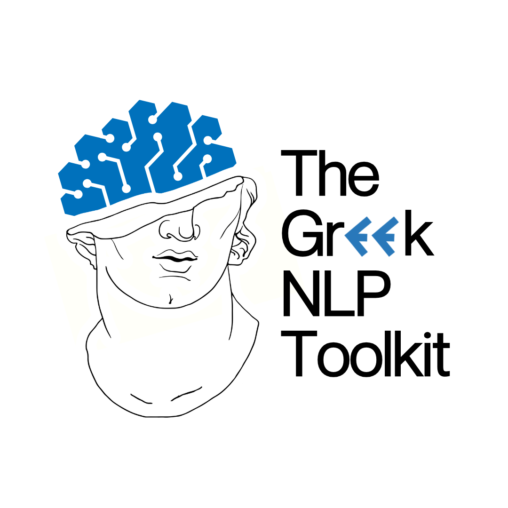

# `gr-nlp-toolkit`: The state-of-the-art Greek NLP Toolkit.

<p align="center">
  
</p>

`gr-nlp-toolkit` is a Python toolkit with state-of-the-art performance in (modern) Greek, supporting the following functionalities:
1. Named Entity Recognition (NER)
2. Part-of-Speech Tagging (POS Tagging)
3. Morphological tagging
4. Dependency parsing
5. Greeklish to Greek transliteration ("kalimera" -> "καλημερα")

## Web Demo/Playground 

Apart from the python library (details below), you can also interact with `gr-nlp-toolkit` in a no-code fashion by visiting our web playground here: https://huggingface.co/spaces/AUEB-NLP/greek-nlp-toolkit-demo

## Installation
The toolkit is supported for Python 3.9+.

You can install it from PyPI by executing the following in the command line:

```sh
pip install gr-nlp-toolkit
```

## Usage

### Available Processors/Features

To use the toolkit, first initialize a `Pipeline` specifying which task processors you need. Each processor
annotates the text with a specific task's annotations.

For example:
- To obtain Part-of-Speech and Morphological Tagging annotations, add the `pos` processor
- To obtain Named Entity Recognition annotations, add the `ner` processor
- To obtain Dependency Parsing annotations, add the `dp` processor
- To enable the transliteration from Greeklish to Greek, add the `g2g` processor or the `g2g_lite` processor for a lighter but less accurate model
  (Greeklish to Greek transliteration example: "thessalonikh" -> "θεσσαλονίκη")

### Example Usage Scenarios

- DP, POS, NER processors (input text in Greek)

  ```python
  from gr_nlp_toolkit import Pipeline

  nlp = Pipeline("pos,ner,dp")  # Instantiate the Pipeline with the DP, POS and NER processors
  doc = nlp("Η Ιταλία κέρδισε την Αγγλία στον τελικό του Euro 2020.") # Apply the pipeline to a sentence in Greek

  ```

  A `Document` object is created and is annotated. The original text is tokenized
  and split to tokens

  ```python
  # Iterate over the generated tokens
  for token in doc.tokens:
    print(token.text) # the text of the token

    print(token.ner) # the named entity label in IOBES encoding : str

    print(token.upos) # the UPOS tag of the token
    print(token.feats) # the morphological features for the token

    print(token.head) # the head of the token
    print(token.deprel) # the dependency relation between the current token and its head
  ```

  `token.ner` is set by the `ner` processor, `token.upos` and `token.feats` are set by the `pos` processor
  and `token.head` and `token.deprel` are set by the `dp` processor.

  A small detail is that to get the `Token` object that is the head of another token you need to access
  `doc.tokens[head-1]`. The reason for this is that the enumeration of the tokens starts from 1 and when the
  field `token.head` is set to 0, that means the token is the root of the word.

- Greeklish to Greek Conversion (input text in Greeklish)

  ```python
  from gr_nlp_toolkit import Pipeline
  nlp  = Pipeline("g2g")  # Instantiate the pipeline with the g2g processor

  doc = nlp("O Volos kai h Larisa einai sth Thessalia") # Apply the pipeline to a sentence in Greeklish
  print(doc.text) # Access the transliterated text, which is "ο Βόλος και η Λάρισα είναι στη Θεσσαλία"
  ```
- Use all the processors together (input text in Greeklish)

  ```python
  from gr_nlp_toolkit import Pipeline
  nlp = Pipeline("pos,ner,dp,g2g")  # Instantiate the Pipeline with the G2G, DP, POS and NER processors

  doc = nlp("O Volos kai h Larisa einai sthn Thessalia") # Apply the pipeline to a sentence in Greeklish

  print(doc.text) # Print the transliterated text

  # Iterate over the generated tokens
  for token in doc.tokens:
    print(token.text) # the text of the token

    print(token.ner) # the named entity label in IOBES encoding : str

    print(token.upos) # the UPOS tag of the token
    print(token.feats) # the morphological features for the token

    print(token.head) # the head of the token
    print(token.deprel) # the dependency relation between the current token and its head
  ```

## Paper

Read the full technical report/paper here: https://arxiv.org/abs/2412.08520

If you use our toolkit, please cite it with the following bibtex:
```bibtex
@misc{loukas2024grnlptoolkitopensourcenlptoolkit,
      title={GR-NLP-TOOLKIT: An Open-Source NLP Toolkit for Modern Greek}, 
      author={Lefteris Loukas and Nikolaos Smyrnioudis and Chrysa Dikonomaki and Spyros Barbakos and Anastasios Toumazatos and John Koutsikakis and Manolis Kyriakakis and Mary Georgiou and Stavros Vassos and John Pavlopoulos and Ion Androutsopoulos},
      year={2024},
      eprint={2412.08520},
      archivePrefix={arXiv},
      primaryClass={cs.CL},
      url={https://arxiv.org/abs/2412.08520}, 
}
```

----
### Technical Notes:

- The *first* time you use a processor, the models are downloaded from Hugging Face and stored into the .cache folder. The NER, DP and POS processors are each about 500 MB, while the G2G processor is about 1.2 GB in size.
- If the input text is already in Greek, the G2G (Greeklish-to-Greek) processor is skipped.
- If your machine has an accelerator but you want to run the process on the CPU, you can pass the flag `use_cpu=True` to the Pipeline object. By default, `use_cpu` is set to *False*.
- The Greeklish-to-Greek transliteration processor (ByT5) weights can be found in HuggingFace: [https://huggingface.co/AUEB-NLP/ByT5_g2g](https://huggingface.co/AUEB-NLP/ByT5_g2g)
- The NER/POS/DP processors/weights can be found in HuggingFace: [https://huggingface.co/AUEB-NLP/gr-nlp-toolkit](https://huggingface.co/AUEB-NLP/gr-nlp-toolkit)

## References
While many methodology details are shared in the [GR-NLP-TOOLKIT paper publication @ COLING 2025 (see above)](https://arxiv.org/abs/2412.08520), additional research details can be found here:
1. C. Dikonimaki, "A Transformer-based natural language processing toolkit for Greek -- Part of speech tagging and dependency parsing", BSc thesis, Department of Informatics, Athens University of Economics and Business, 2021. http://nlp.cs.aueb.gr/theses/dikonimaki_bsc_thesis.pdf *(POS/DP/Morphological tagging processor)*

2. N. Smyrnioudis, "A Transformer-based natural language processing toolkit for Greek -- Named entity recognition and multi-task learning", BSc thesis, Department of Informatics, Athens University of Economics and Business, 2021. http://nlp.cs.aueb.gr/theses/smyrnioudis_bsc_thesis.pdf *(NER processor)*

3. A. Toumazatos, J. Pavlopoulos, I. Androutsopoulos, & S. Vassos, "Still All Greeklish to Me: Greeklish to Greek Transliteration." In Proceedings of the 2024 Joint International Conference on Computational Linguistics, Language Resources and Evaluation (LREC-COLING 2024) (pp. 15309–15319). https://aclanthology.org/2024.lrec-main.1330/ *(Greeklish-to-Greek processor)*